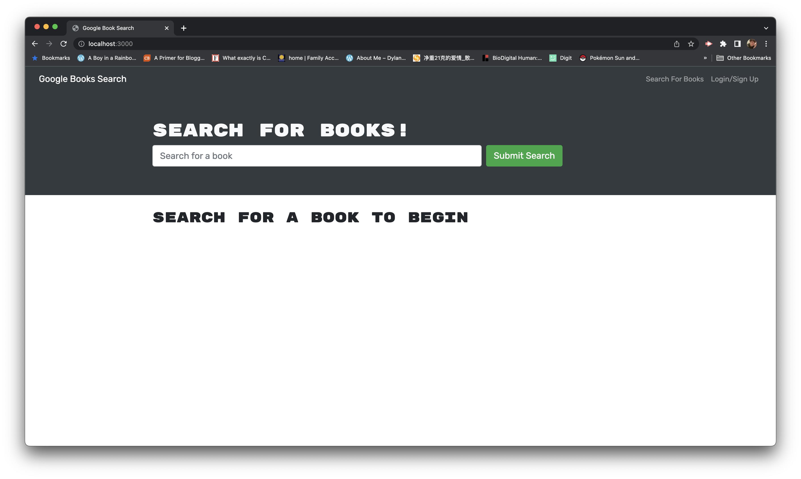
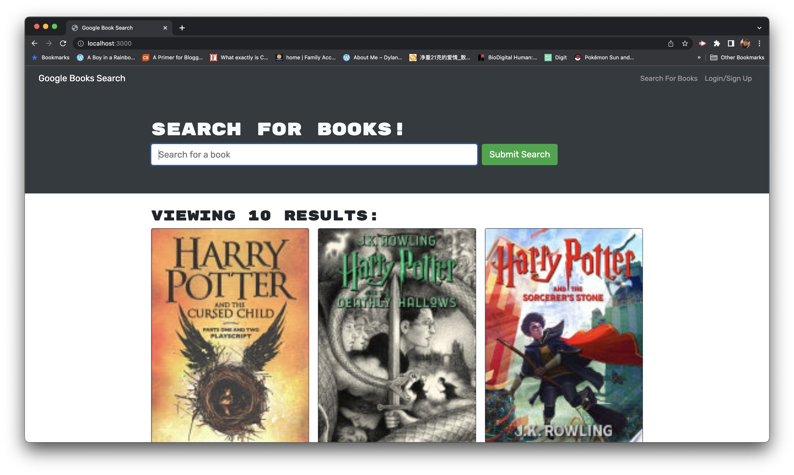

<h1 align="center">📚 Book Search Engine</h1>

<p align="center">
    <a href="https://github.com/jasonsin88"></a>
    <a href="https://twitter.com/_anotherjason">
        
    </a>
</p>

<p align="center">
    
    
    
    
    
    
</p>

## Description

a fully functioning Google Books API search engine built with a RESTful API that was refactored to be a GraphQL API built with Apollo Server. The app was built using the MERN stack, with a React front end, MongoDB database, and Node.js/Express.js server and API. It's already set up to allow users to save book searches to the back end.

Deployed live app at: https://desolate-chamber-65289.herokuapp.com/

## Table of Contents
- [Technologies](#technologies)
- [Installation](#installation)
- [Screenshots](#screenshots)
- [License](#license)
- [Contributing](#contributing)

## Techonologies

This project is created with the following technologies:
- Javascript
- GraphQL
- Node.js
- Express.js
- React
- MongoDB
- Apollo Server
- Google Books API

## Installation
To get started, clone this repository by inputting the following into your terminal:
<br>
```
git clone git@github.com:jasonsin88/BookSearchEngine.git
```

Install dependencies under Client, Server, and Main directories:
```
npm i
```

After installation is completed, input the following under the Main directory to run the application:
```
npm run develop
```

## Screenshots
Book Search Engine homepage:


Book Search Engine searched for "Harry Potter":


## License
[](https://opensource.org/licenses/MIT) <br/>
This project is licensed under MIT

## Contributing
:ghost: [Jason Sin](https://github.com/jasonsin88)